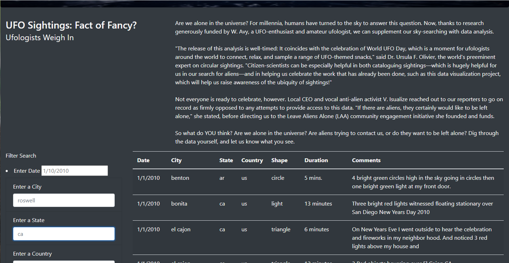
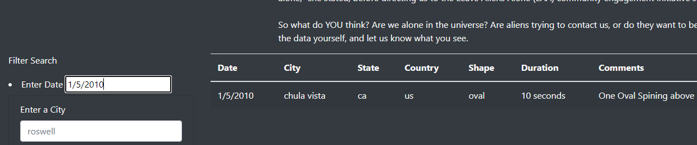
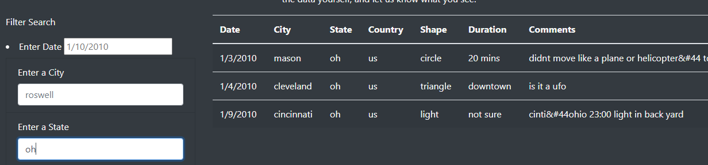

# UFOs

## Project Overview

Using data of UFO sightings, an interactive website was designed to allow site visitors to search for instances of UFO sightings. Visitors can filter recorded sightings by date, city, state, country, and shape.

## Resources

### Data Sources 

data.js

### Software 

* JavaScript

* VSCode

* Bootstrap 3

* HTML/CSS

## Results

Use of the website:

Upon arriving at the  website, users will see a Filter Search  area with options to enter a date, city, state, country, and shape:

Users may then enter a date if looking for results for a specific day, results are shown to the right:

In addition to searching by date, users can utilize any of the other fields to filter their search:

Users can use a single filter or combine any number of them to return desired results.

## Summary

One drawback to the site is that when no results are found for a given criterion, there is no message indicating this, only a blank search results area. This can be frustrating for a visitor who might be unsure if the search was even run,  or if there are in fact, no results.

This could be remedied by adding an else statement to populate a ‘no results found’ message if there is no matching data for the criterion.

An additional recommendation would be to have drop-down menus for the cities and states that have data connected to them. This would eliminate any spelling error issues and offer the visitor a view of what potential data points they could find.
